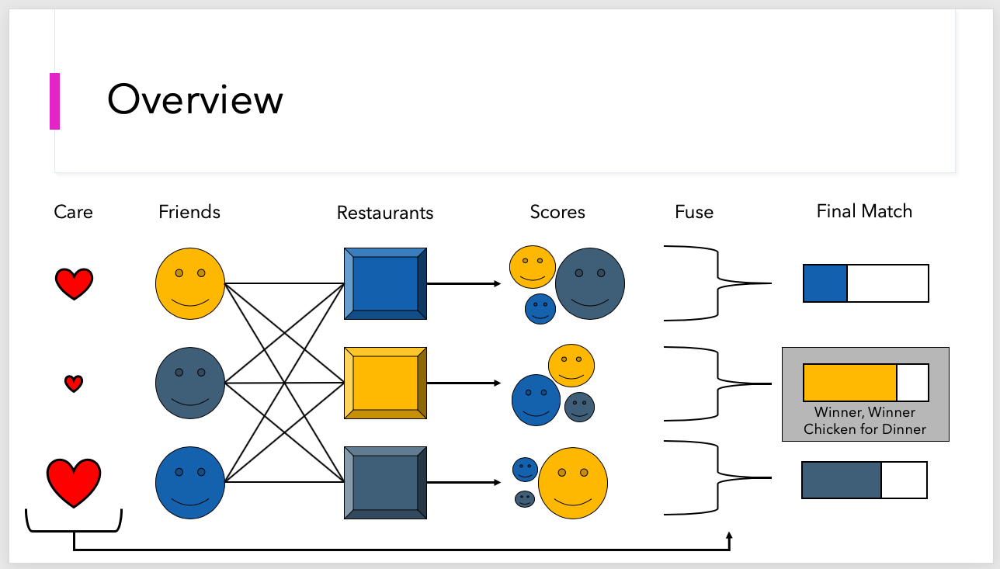

# Management Under Uncertainty - Project 1

> This project utilizes several forms of aggregation in order to suggest places for a group of people to dine.

This figure is an illustrates an overview of the process to accomplishes this task.
[]()

## Requirements
To install the requirements for this project, please run the following conda commands.

```shell
$ conda install plotly -c plotly
$ conda install -yc anaconda cvxopt numpy pandas
```
- cvxopt is the quadratic program package
- numpy come on, you've gotta already know what this is
- pandas I like the dataframes this provides
- plotly used for easy plotting ;)


---

## Running 
- By default, this code will determine several dinner suggestions relative to 3 people.
- To customize, change the default parameters in the code.
- By defalut, this code will aggregate features with by averaging them
- To customize, change the operation to 'min', 'soft-min', 'avg', 'soft-max' or 'max'
---

These are the lines that must change in order to customize this problem. By changing the parameters for each of the
features, this problem can take on custom arguments. Also, by chaning the variable in the list 'aggs' different 
feature aggregation can be used. 
```javascript
// code away!
    bryce = Actor(name = 'Bryce', rating='=5', price='=$$',    travel='>.2', cat=['burger'], confidence=1)
    kate =  Actor(name = 'Kate',   rating='=3.5',   price='=$',   travel='<.5', cat=['chinese'], confidence=1)
    matt =  Actor(name = 'Matt',   rating='>3',   price='=$',    travel='>.6', cat=['italian'], confidence=1)

    aggs = ['avg']

```

---

## Example Outputs
Here is an example output of the default parameters
This figure is an illustrates an overview of the process to accomplishes this task.
[Example Output](images/Screen Shot 2020-03-16 at 7.28.32 PM.png)

